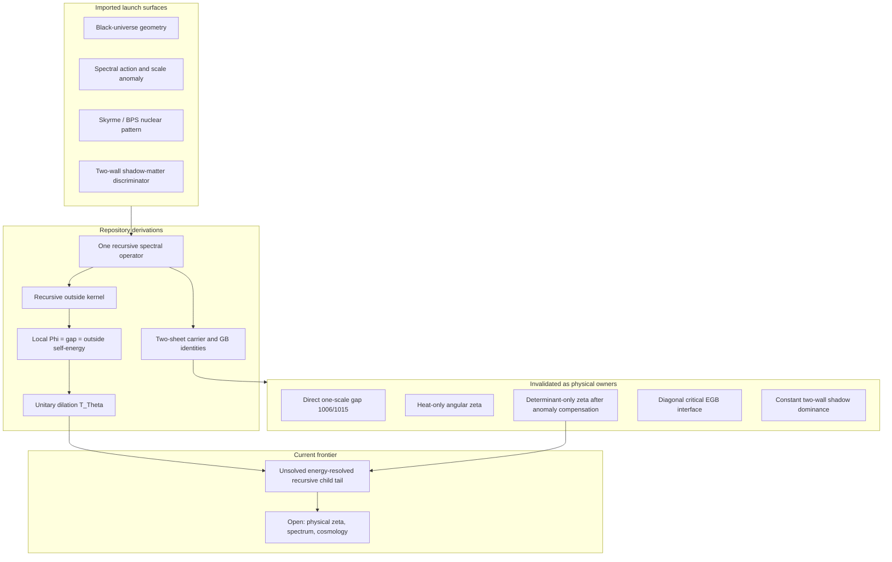

# Nested-Space Cosmology

The whole proposal is one recursive spectral equation, not a list of separately fitted laws:

$$
\boxed{
Z_{\Lambda}^{\mathrm{one}}(\mathbb D_\Theta)
=
\int \mathcal D\varphi\,
Z_\Lambda\!\left(
e^{-\varphi/2}\mathbb D_\Theta e^{-\varphi/2}
\right),
\qquad
\mathcal T_\Theta^*\mathbb D_\Theta=\mathbb D_\Theta.
}
$$

Its present concrete regulated action uses the heat-spectral profile
\(\operatorname{Tr}e^{-\mathbb D_\Theta^2/\Lambda^2}\) plus the fermionic
quadratic form. Every named local quantity is supposed to be a projection of
this one operator: constants, particle poles, wave residues, nuclear energy,
unresolved (“dark”) metric response, and the black-to-child boundary. The
configuration of a room can change. The law, the dimensionless coefficient
vector \(\Theta\), and the boundary kernel must not.

This repository is a conjectural research programme. It does **not** prove Nested-Space Cosmology, a final inheritance scale \(\zeta\), a particle spectrum, a dark-sector fit, or that our universe is inside a black hole.

The conceptual thesis, in one chain:

```text
spaces form inside spaces
  -> local constants are formation parameters of one room
  -> singularity and infinity mark failed local charts, not completed objects
  -> parent collapse and child expansion are two sides of one finite transition
  -> unresolved rooms act locally through the same kernel
  -> the next generation repeats the same law
```

## Authorship and AI contribution

**Douglas Ek** is the accountable author: research direction, conceptual synthesis, scientific decisions, and publication responsibility.

The public documents, derivations, scripts, and compact results were developed in iterative collaboration with **ChatGPT** and **OpenAI Codex**. The AI collaborator drafted formal language, code, literature comparisons, and adversarial checks. Every AI contribution is candidate work until it matches explicit mathematics, committed computation, cited sources, and the JSON nonclaims. AI credit records material assistance; it does not transfer scientific accountability.

## Current frontier

**The current frontier is the unsolved energy-resolved recursive child tail.**

Anomaly compensation removed the determinant-only scale roots. Adding an independently weighted geometric action is forbidden double-counting. The missing owner is the child’s own next-child response. The derived, still unsolved, functional equation is

$$
\Gamma(x)
=
K(x)
-
B^{\dagger}\,
\Gamma(x/\Omega)^{-1}
B.
$$

\(\Omega\) is not selected. The mode-resolved tail is not solved on the warped transition spectrum. Physical \(\zeta\) is not derived. See [docs/current-result.md](docs/current-result.md).

## What is imported

These are launch surfaces, not project novelty. Primary sources are collected
in [docs/prior-art-and-open-claim.md](docs/prior-art-and-open-claim.md) and the
technical paper's references.

| Subject | Status in this repository |
|---|---|
| Single-electron interference, QFT field excitations, Bell nonlocality, PBR | Experimental and theoretical constraints on any particle ontology |
| Skyrme/BPS solitons and nuclear binding | Construction pattern for stationary charge sectors |
| Einstein–BPS compact-star branches | Gravity benchmark from nuclear-fixed parameters |
| Exact regular black-universe geometry | Limiting trapped-to-expanding four-geometry |
| RS2 projected Weyl term as outside response | Structural realization of unresolved-room geometry |
| Two-wall shadow matter and the \(3/4\) lensing discriminator | Other-room gravity acting on the local sheet |
| Chamseddine–Connes spectral action | Local-room Standard Model plus gravity scaffold |
| Local Higgs–dilaton scale anomaly | Common local Weyl mode, not two independent sheets |
| Doubled spectral FLRW / relative-metric interaction | Leading two-geometry interaction |
| Nonlocal spectral propagation wall | High-resolution cutoff of local boson propagation |
| Wetterich exact effective-action flow | Resolution-flow mathematics |
| Baby-universe / cosmological-natural-selection literature | Prior hypothesis class, not an observation |

## What this repository derives

The repository binds imported components to one operator, derives identities that those components do not already state, and records numerical diagnostics with explicit nonclaims.

Derived here, always conditional on the stated premises:

- one immutable \(\Theta\) with no hard-coded sector masses;
- nested \(L0\)–\(L6\) self-equality reducing Skyrme scale coefficients to one overall normalization;
- the dictionary that *names* local constants as Hessian/spectral outputs of \(S_{\mathrm{one}}\);
- the two-sheet representation of a noninjective areal-radius black-universe chart;
- the transition-fixed Gauss–Bonnet coupling \(\alpha_{\mathrm{GB}}/L_\star^2=1015/144\) and the on-room vacuum-form component \(108/1015\);
- the scalar recursive outside kernel \(\Gamma=K-b^2/\Gamma\);
- the exponential heat profile from composition of resolution steps;
- the local identity that one off-diagonal \(\Phi\) is mass gap, Schur self-energy, and relative-metric link;
- child-side orientation of the source sign, later corrected by the exact child asymptotic;
- a global horizon-penetrating spectral foliation and a derived throat Neumann-jump operator;
- the unitary dilation that makes \(\mathcal{T}_\Theta\) executable, with \(\zeta=\Omega^2\).

Numerical diagnostics that **must not** be read as a final \(\zeta\) or a particle-to-cosmology number are listed in [docs/current-result.md](docs/current-result.md).

## What the anomaly invalidated

Compensating the pure cutoff anomaly of the invariant partition function **invalidated the determinant-only inheritance-scale roots**. After that compensation, the joined-minus-disconnected child-link derivative stays negative on the scanned domain \(3\pi/2<\zeta\le 200\). Those earlier numbers remain useful diagnostics. They are not stationary points of the one equation.

Related routes already rejected on their own JSON nonclaims, and not repaired by retuning \(\Phi\) or adding a second geometric weight:

- \(\Lambda L_\star=1\) as the physical child-matched gap (the exact child vacuum requires \(\zeta>3\pi/2\));
- the lowest-mode heat-only scale minimum (the angular tower removes the root);
- independently weighted Einstein–Gauss–Bonnet or heat geometry as the missing scale owner (double-counting);
- pure critical five-dimensional Einstein–Gauss–Bonnet as the complete interface law (time-principal rank \(5/10\); no scanned diagonal normalization restores real characteristics);
- the standalone bosonic heat-trace graviton covariance as a positive Stieltjes propagator;
- the inverse relative heat Hessian as Osterwalder–Schrader positive metric covariance;
- constant two-wall shadow matter as the dominant kiloparsec gravitating mass.

## Map



## Reproduce the public result

The complete current dependency closure is small enough to recompute on a
laptop. The reference run regenerated all 58 artifacts byte-for-byte in about
four minutes:

```bash
python3 -m pip install -e ".[paper]"
make reproduce
make paper-check
```

Run `make verify` for the integrated manifest, focused-test, reproduction, and
paper gate. Regeneration happens in an isolated temporary workspace and never
rewrites the tracked result files. See
[docs/reproducing.md](docs/reproducing.md) for exact and cross-platform modes.

## Documents

| File | Role |
|---|---|
| [THEORY.md](THEORY.md) | Public theory with labeled evidence status |
| [AGENTS.md](AGENTS.md) | Short working orientation for the one-equation thesis |
| [docs/prior-art-and-open-claim.md](docs/prior-art-and-open-claim.md) | Imported results and the one open joint claim |
| [docs/current-result.md](docs/current-result.md) | Present compact checkpoint and nonclaims |
| [docs/reproducing.md](docs/reproducing.md) | How to inspect and regenerate compact results |
| [results/README.md](results/README.md) | Category map for the 58-artifact chain |
| [CONTRIBUTING.md](CONTRIBUTING.md) | Claim discipline and contribution rules |
| [paper/nested-space-cosmology.md](paper/nested-space-cosmology.md) | Technical paper source |
| [paper/nested-space-cosmology.pdf](paper/nested-space-cosmology.pdf) | Reproducibly generated working preprint |

## How to read a claim

Statements in this repository are labeled in [THEORY.md](THEORY.md):

- **Postulate** — a model requirement, not a theorem.
- **Imported result** — established literature or observation, used as a launch surface.
- **Repository derivation** — an identity or closure obtained here from stated premises.
- **Numerical diagnostic** — a computed number whose JSON record forbids promotion.
- **Open prediction** — a quantity that would count as a result if derived without using the compared datum.
- **Interpretive hypothesis** — a picture that is not itself an action, spectrum, or observation.

If a compact JSON `nonclaims` flag is `false`, public prose must not say the corresponding statement has been shown.

## Citation and licence

Citation metadata are in [CITATION.cff](CITATION.cff). Douglas Ek is the
accountable author; the AI contribution is disclosed above and in the paper.
Code is MIT-licensed, original prose and figures are CC BY 4.0, and cited
third-party work retains its original terms. See [LICENSE](LICENSE).

Security reports use [SECURITY.md](SECURITY.md); scientific disagreements and
reproduction failures belong in the ordinary issue tracker.
