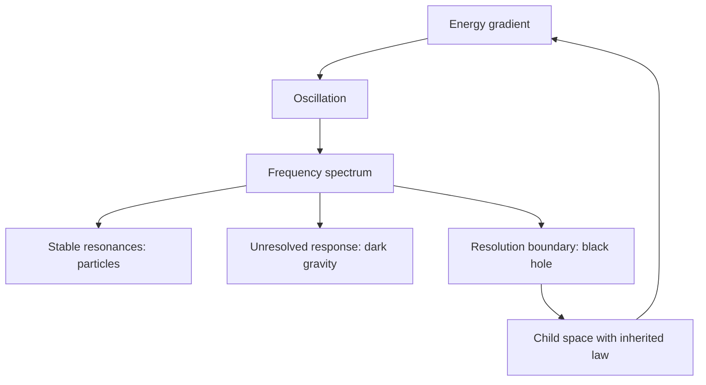

# Nested-Space Cosmology

## What if reality is one inherited spectrum?

A musical note is not a thing separate from its wave. It is a stable pattern
inside an oscillation. Change the frequency and the same underlying motion
appears as a different note.

Nested-Space Cosmology asks whether nature works the same way at every scale:

> **One field. One spectrum. Different stable patterns that we call particles,
> forces, matter, antimatter, dark gravity, black holes, and expanding space.**



A local universe is a **room** with its own clocks, rulers, frequencies, and
resolution. A black hole is the boundary where the parent room can no longer
represent a compressed gradient as an ordinary local object. The proposal is
that the process continues as a child room. The child inherits the same
dimensionless relationships while expressing a wider range of structure.

[Read the idea in plain language](THEORY.md) ·
[Follow the equations and evidence](docs/current-result.md) ·
[Open the working paper](paper/nested-space-cosmology.pdf)

## From a note to a universe

Every room has a Dirac operator. Its eigenvectors are possible patterns and
its eigenvalues are their natural frequencies:

$$
\boxed{
\mathbb D_n u_{n,k}=\omega_{n,k}u_{n,k},
\qquad
\omega_{n,k}=\Lambda_n\widehat\omega_k(\Theta).
}
$$

- $\Lambda_n$ is the room's frequency and resolution scale.
- $\widehat\omega_k$ is a dimensionless note in the inherited spectrum.
- $\Theta$ is the law shared by parent and child.

If a child has scale ratio $\Omega$, then

$$
\Lambda_{n+1}=\Omega\Lambda_n,
\qquad
\frac{\omega_{n+1,k}}{\Lambda_{n+1}}
=\frac{\omega_{n,k}}{\Lambda_n}.
$$

The absolute range changes. The relationships—the musical intervals of the
law—remain the same.

## One spectrum, many familiar names

| What we observe | What it is in the spectral picture |
|---|---|
| **Wave** | The extended amplitude and phase of a field pattern |
| **Particle** | A stable pole or localized resonance of that same field |
| **Matter and antimatter** | The positive- and negative-frequency Dirac sectors, related by charge conjugation |
| **Mass** | The rest-frequency gap of a physical pole |
| **Dark energy** | The smooth, near-zero-momentum part of the response inherited from unresolved rooms |
| **Dark matter** | The finite-wavelength part of that response, acting through clustering and lensing |
| **Black hole** | A causal and resolution boundary reached by a sufficiently compressed gradient |
| **Child universe** | The continuation of that gradient in a new room with inherited spectral law |
| **Complexity** | More distinguishable modes and stable combinations within a wider resolved spectrum |

The matter–antimatter correspondence is a frequency orientation, not merely
the drawn height of a sine wave:

$$
\Psi(x)=\sum_s\int d^3p\,
\left[
a_s(\mathbf p)u_s(\mathbf p)e^{-ip\cdot x}
+b_s^\dagger(\mathbf p)v_s(\mathbf p)e^{+ip\cdot x}
\right].
$$

The two phases $e^{-i\omega t}$ and $e^{+i\omega t}$ become particle and
antiparticle sectors after quantization. Charge conjugation reverses the gauge
representation. A real sine wave displays both orientations:

$$
\sin(\omega t)=\frac{e^{i\omega t}-e^{-i\omega t}}{2i}.
$$

## A black hole already plays a cosmic bass note

The Perseus galaxy cluster contains literal pressure waves driven by repeated
outbursts from its central supermassive black hole. Their period is just under
ten million years:

$$
\nu_{\rm Perseus}\simeq3.3\times10^{-15}\ \mathrm{Hz},
$$

about 57 octaves below the B-flat above middle C. The waves carry energy into
the surrounding gas and help prevent it from cooling. This is measured
black-hole feedback expressed as frequency, scale, and energy transfer—not
just a sonification metaphor. [Chandra explains the pressure waves and octave
calculation](https://chandra.harvard.edu/chronicle/0303/perseus/index.html).

NSC applies the same spectral language across a much larger range. Since

$$
E=\hbar\omega,
\qquad
\lambda=\frac{2\pi c}{\omega},
$$

higher frequencies resolve shorter lengths. Concentrating enough energy to
reach the local resolution wall changes the geometry. The black-hole boundary
then becomes the handoff between the parent spectrum and its child.

At that boundary, reflection and transmission are two parts of one scattering
response:

$$
|R(\omega)|^2+|T(\omega)|^2=1.
$$

The parent observes what returns through $R$. The part carried through $T$
continues beyond its locally accessible chart. A black shadow, a throat, and
an expanding interior are therefore three observer-dependent views of the
same boundary problem. The repository computes the complex Dirac reflection,
transmission, and the inherited child stress for its smooth benchmark.

## How another room acts without being locally visible

Put a parent and child in one block operator:

$$
H=
\begin{pmatrix}
H_p&B\\
B^\dagger&H_c
\end{pmatrix}.
$$

Eliminating the child does not erase it. It leaves a visible self-energy:

$$
\boxed{
G_{pp}(E)^{-1}
=E-H_p-B(E-H_c)^{-1}B^\dagger.
}
$$

This one formula explains how something outside local resolution can still
change local motion. Its momentum limits have different appearances:

$$
\Pi_{\rm outside}(k\rightarrow0)
\longrightarrow\text{smooth background expansion},
$$

$$
\Pi_{\rm outside}(k>0)
\longrightarrow\text{clustering and lensing response}.
$$

That is the proposed common origin of dark energy and dark matter: two ranges
of one boundary response rather than two unrelated invisible substances.

The familiar rounded $5\%/25\%/70\%$ split is used only as an observational
target from a $\Lambda$CDM fit. It suggests a concrete hierarchy to calculate:

| Observation | NSC interpretation to test | What must be calculated |
|---|---|---|
| $\sim5\%$ baryons | Locally resolved spectrum | Physical poles, residues, charges, and sector assignments |
| $\sim25\%$ dark matter | Nearest unresolved room response and finite-$k$ Schur projection | Pressure perturbations, anisotropic stress, clustering, and growth |
| $\sim70\%$ dark energy | More distant recursive tail and zero-momentum projection | Background density and pressure, conservation, and $H(z)$ |

This ordering is a measurable hypothesis. The fractions do not prove it, and
the fixed-$q$ scale candidate does not determine these cosmological weights.

## The law that every room inherits

The complete proposal is compressed into

$$
\boxed{
\mathcal T_\Theta^*\mathbb D_\Theta=\mathbb D_\Theta.
}
$$

The configuration changes from parent to child. The dimensionless law does
not. The child's own descendants are already contained in its response:

$$
\boxed{
\Gamma_p(x)
=K_p(x)-\frac1\Omega
b\,\Gamma_c(x/\Omega)^{-1}b^\dagger.
}
$$

The zero of gravitational energy is also relational. The recursive
zero-tadpole law removes only the homogeneous unlinked vacuum term:

$$
\boxed{
\Gamma_{\rm rel}=(1-\mathcal P_0)\Gamma_{\rm one},
\qquad
(V,A,C)\mapsto(0,A,C).
}
$$

Curvature, gauge response, Casimir energy, links, and finite boundary effects
remain. In the charged-throat map this gives $V_{\rm full}=\lambda_4=\Xi=0$
without changing $G_N$, the gauge coefficient, charge radius, or throat length.

## What the calculations already connect

| Connection | Result | Reproducible evidence |
|---|---|---|
| One link controls mass and visible response | $E^2=\lvert\mathbf p\rvert^2+\Phi^2$ and $\Sigma_p(E)=\Phi^2(E+\boldsymbol\alpha\cdot\mathbf p)^{-1}$ | [Dirac reduction](docs/nsc-observable-bridge.md) |
| Geometry determines transmission | Direct propagation, transfer matrices, and boundary elimination agree below $2.3\times10^{-15}$ in the recorded full-spinor system | [Boundary calculation](docs/nsc-chiral-boundary.md) |
| One coherence stores energy and transfers occupation | $E_{\rm link}=2\Re\mathrm{Tr}(BC_{cp})$ and $\dot N_p=2\Im\mathrm{Tr}(BC_{cp})$ | [Common-source derivation](docs/nsc-common-source-derivation.md) |
| Geometry can become particles | A smooth radius pulse creates Dirac pairs and its work equals their energy | [Vacuum-work experiment](docs/nsc-vacuum-work.md) |
| Parent data determine child stress | Both recorded radial null contractions are about $-0.05280$ and the parent power is $1.4222\times10^{-4}$ | [Parent-matched source](docs/nsc-unruh-state.md) |
| Causal response and geometric source share one state | Canonical CTP returns metric forces, retarded response, noise, and energy balance from one covariance | [Causal common functional](docs/nsc-causal-common-functional.md) |
| Homogeneous vacuum has a unique relational zero | The idempotent $a_0$ projector sets $V_{\rm full}=0$ while preserving gradient response | [Relational vacuum law](docs/nsc-relational-vacuum-normalization.md) |
| The charged radius fixes a candidate inherited scale | The first cutoff-resolved branch among the checked $q=2,3,4$ sectors gives $\Omega=3.9730743688$ and $\zeta=15.7853199397$ | [Scale binding](docs/nsc-scale-binding.md) |
| The simplest recursive LLL source is decisively testable | Its inherited power closes exactly, but its two null signs do not source the black-universe neck | [Source binding](docs/nsc-recursive-source-binding.md) |
| Positive compact modes complete the free CTP neck source | The completed tensor has $T_{++}=-0.246592$ and $T_{--}=-0.251487$ at the locked scale | [Compact CTP completion](docs/nsc-compact-ctp-completion.md) |
| The completed source enters the child energy ledger | Proper volume and child time give $\dot\rho_0=0.3877601353$ with total regular bulk $Q=0$ | [Background projection](docs/nsc-background-projection.md) |
| Backreaction has an exact initial gate | The locked source misses the Hamiltonian and momentum constraints already at $T=0$ | [Backreaction gate](docs/nsc-child-metric-backreaction.md) |
| The same source selects constraint-complete geometry | Its Landau normal and $r_\star=0.9453283944$ close both initial constraints | [Constraint-complete neck](docs/nsc-constraint-complete-neck.md) |
| Coupled evolution has an exact state-data gate | The radius vertex is nonzero, so later pressure requires the actual mode covariance | [Coupled evolution gate](docs/nsc-coupled-ctp-metric-evolution.md) |
| The retained Gaussian state is now explicit | A deterministic payload stores all 1,904 physical covariance blocks and reconstructs the old tensor | [Mode-resolved state](docs/nsc-mode-resolved-cauchy-state.md) |
| A declared history gives a unitary Cauchy map | Two endpoint-identical histories preserve CAR but produce different $U$, so the physical history remains the selector | [Landau Cauchy gate](docs/nsc-landau-cauchy-isometry.md) |

The background projection uses the exact completed tensor on the stored
Bronnikov child geometry. Volume dilution contributes `-0.1568673338` and
directional pressure work contributes `+0.5446274691`; the conservation and
parent-power map close below `4.4e-16`. The parent Killing power becomes the
opposite of a conserved child spatial-momentum charge, so it is not counted
again as a continuing child energy source.

The next ADM gate is decisive before time stepping. With the locked Einstein
coefficient, the same neck has normalized Hamiltonian and momentum residuals
`-0.1189448139` and `-0.01359270885`. Both null signs remain negative, but the
metric and source do not share a valid Cauchy surface. The exact required
completion is `delta_rho=-0.01070963923` and
`delta_T01=-0.001223870156`; no parameter or initial metric was changed to
hide it.

Permitted geometry route B now closes that gate. The completed stress fixes a
unique Landau normal with `v=0.004914475707`, and its density fixes
`r_star=0.945328394434` while `H_sphere=0` remains a temporal minimum. The
maximum ADM residual is `2.2e-16`; both null contractions remain negative.
This source-selected Kantowski--Sachs neck replaces the stored unit-radius
Bronnikov profile without changing the action or state parameters.

The first same-state evolution step then exposes the next exact dependency.
Changing to `r_star` changes the angular Hamiltonian by `5.7833%`, and the
fixed-covariance density vertex is `-0.460688`. The stored result contains four
integrated stress moments but not the complex mode covariances needed by
`C_dot=-i[H,C]`. The trajectory therefore records its break at `T=0` rather
than replacing the missing commutators with frozen pressure or an assumed
equation of state.

The mode-resolved state now removes the serialization gap. Its 33 channels
cover the LLL, twelve massive angular sectors and twenty positive-compact
sectors. Cold reload passes CAR and reconstructs the complete old-surface
tensor with maximum residual `9.1e-13`. The remaining gate is narrower: a
physical Dirac Cauchy isometry to the tilted Landau slice and general-KS
fourth-order/local history providers.

The blockwise Landau propagator is now executable for any supplied
Kantowski--Sachs/ADM history. Two smooth controls share all source-selected
endpoint data and preserve unitarity below `1.2e-14`, but their maps differ by
`1.99967`. Endpoint data therefore do not determine the physical Cauchy map or
finite `r_star` stress; selecting either control would insert an unowned
history duration/profile.

## Explore at your own depth

1. [The theory in one continuous story](THEORY.md)
2. [The calculated equations and numbers](docs/current-result.md)
3. [The 22-record development update](docs/development-update-2026-09-10.md)
4. [The 100-record preprint manifest](results/manifest.json)
5. [How to inspect and reproduce results](docs/reproducing.md)
6. [The working paper](paper/nested-space-cosmology.pdf)

```sh
python3 -m pip install -e '.[paper]'
make demonstrate
```

The default demonstration reads authenticated stored results without launching
the expensive scientific generators.

## Research status

NSC is an active theoretical programme and working preprint. Its exact
identities and numerical results apply to the operators, states, domains, and
approximations named in their records. The common recursive interpretation is
the theory being assembled from those results. A complete self-sourced
parent-to-child solution, identified particle spectrum, and independent
cosmological prediction remain the final integration targets.

## Authorship

**Douglas Ek** provides the conceptual synthesis, research direction, and
scientific responsibility. ChatGPT/OpenAI Codex assisted with formulation,
derivations, software, computation, and writing; Grok supplied bounded
investigations. The principal collaborating sessions are identified as
GPT-5.6 Sol and GPT-6 Astra.

Code: MIT. Original prose and figures: CC BY 4.0.
[Citation](CITATION.cff) · [Contributing](CONTRIBUTING.md) · [Licence](LICENSE)
