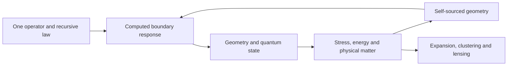

# Nested-Space Cosmology

**One recursive law. Connected geometry, matter and boundary response.**

Nested-Space Cosmology develops Douglas Ek's proposal that finite spaces form inside other spaces through collapse, localization and renewed expansion. The same operator should describe what is locally resolved as matter, what arrives through an unresolved boundary, and how a parent collapse continues into a child domain:

$$
\mathcal T_\Theta^*\mathbb D_\Theta=\mathbb D_\Theta.
$$

The project makes this connection concrete through reproducible operator calculations. The current working preprint joins evaluated throat maps, smooth geometric spectra, causal Dirac transport, quantum vacuum response, energy/work accounting, and an exact sheet–chirality reduction in one narrative.

**The research target is a self-sourced physical solution:** the same action and state must determine the geometry, its matter and its observable consequences. The strongest verified milestones and remaining equations are presented together in the [working preprint](paper/nested-space-cosmology.pdf).

## Six questions, one construction

| Research question | Current mathematical connection | Next physical link |
|---|---|---|
| Where do local constants and thermal limits come from? | Characteristic cones, scale identities and covariant measure | Derived gravitational coupling and physical thermal state |
| Can collapse continue into an expanding room? | Smooth geometry, horizon Dirac transport and clock/affine tests | Self-sourced dynamics and complete continuation |
| Can adjacent rooms explain dark response? | Boundary self-energy, vacuum stress and source conservation | Joint expansion, clustering and lensing prediction |
| Can one state explain particles, waves and detection? | Field excitations and collective-coordinate controls | Identified interactions and a detector/statistics calculation |
| Can sheet coupling generate mass and encode chirality? | Exact invariant Dirac sector and charge-conjugation algebra | Actual boundary coupling and physical sector selection |
| Can recursive generation define infinity and probability? | Endpoint bounds and clock-transfer conditions | Consistent recursive state measure and causal duration |

## Follow the evidence



The loop is the physical objective. Its present executable links are:

- **Boundary response:** direct inversion and elimination give the same full-spinor spatial response, checked against radial integration. Its chirality and Clifford channels are evaluated in an explicit domain.
- **Geometry and spectra:** smooth periodic confinement creates a band gap without a manually inserted constant mass. A radial band gap still needs a physical pole and spinor interpretation.
- **Finite action:** smooth-geometry metric variations identify four independent bulk response coefficients for ultraviolet matching.
- **Vacuum and energy:** the static vacuum supplies no continuing regional injection. A changing radius creates Dirac pairs, and the supplied geometric work accounts for their energy.
- **Mass and chirality:** a scalar sheet coupling has an invariant four-component sector equal to the massive Dirac Hamiltonian. The actual throat must derive that coupling and select the physical sector.
- **Observable source:** internal conversion, external supply, pressure and perturbation response have separate, explicit roles in cosmological evolution.

The current frontier is the full spinor boundary interaction and the common covariant state/stress functional. These calculations test the missing connection directly. Physical inheritance scale, particle species, nuclear predictions and a cosmological fit remain open.

## Read and reproduce

1. [Working preprint PDF](paper/nested-space-cosmology.pdf) — main argument, six targets and technical appendices.
2. [Current result](docs/current-result.md) — strongest completed connections and exact next equations.
3. [Labeled theory](THEORY.md) — the organizing hypothesis and its evidence levels.
4. [Result manifest](results/manifest.json) — reproducible records, dependencies and comparison policies.
5. [Observational targets](docs/nsc-observational-targets.md) — how the same action must reach measured quantities.

```sh
python3 -m pip install -e '.[paper]'
make demonstrate
make verify
```

Version 0.2.0 contains **77 records: 58 frozen historical records and 19 scoped follow-ups**. The original v0.1.0 evidence remains byte-for-byte. The short demonstration follows the computed boundary, vacuum-work and spinor reductions; the integrated gate verifies the complete collection and deterministic PDF. [Reproduction details](docs/reproducing.md).

## Scientific attribution and responsibility

**Douglas Ek** supplies the conceptual synthesis, research direction, scientific decisions and publication responsibility. ChatGPT/OpenAI Codex assisted with derivations, code, computation and presentation; Grok provided bounded independent checks. The author identifies the principal collaborating sessions as GPT-5.6 Sol and GPT-6 Astra. AI assistance is verified through the committed calculations, not accepted as proof by attribution.

Spectral action, Dirac theory, Skyrme/BPS constructions, regular black-universe geometries and quantum transport are established launch surfaces. Their original sources are identified in the paper and [prior-art notes](docs/prior-art-and-open-claim.md). The proposed common-action closure is the project-specific research target. This working preprint is not peer reviewed and does not claim that all six explanations or a theory of everything have been established.

Code is MIT-licensed; original prose and figures are CC BY 4.0. [Citation metadata](CITATION.cff), [contribution guidance](CONTRIBUTING.md), and [licence](LICENSE).
