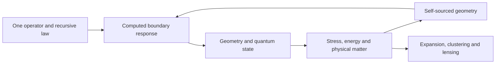

# Nested-Space Cosmology

**One recursive law. Connected geometry, matter and boundary response.**

Research proceeds by [reusing existing formulations](docs/nsc-prior-art-reuse.md)
and computing the missing connections. Published black-universe and
collapse/bounce models are starting points; their compatibility with the
common NSC action is the new task.

Nested-Space Cosmology develops Douglas Ek's proposal that finite spaces form inside other spaces through collapse, localization and renewed expansion. The same operator should describe what is locally resolved as matter, what arrives through an unresolved boundary, and how a parent collapse continues into a child domain:

$$
\mathcal T_\Theta^*\mathbb D_\Theta=\mathbb D_\Theta.
$$

The project makes this connection concrete through reproducible operator calculations. The current working preprint joins evaluated throat maps, smooth geometric spectra, causal Dirac transport, quantum vacuum response, energy/work accounting, an exact sheet–chirality reduction, a specified ultraviolet-subtracted determinant source, and a finite noise–pair relation in one narrative.

**The research target is a self-sourced physical solution:** the same action and state must determine the geometry, its matter and its observable consequences. The strongest verified milestones and remaining equations are presented together in the [working preprint](paper/nested-space-cosmology.pdf).

## Six questions, one construction

| Research question | Current mathematical connection | Next physical link |
|---|---|---|
| Where do local constants and thermal limits come from? | Characteristic cones, scale identities, covariant measure and normalization profiles | Derived gravitational coupling and physical thermal state |
| Can collapse continue into an expanding room? | Smooth geometry, horizon Dirac transport and clock/affine tests | Self-sourced dynamics and complete continuation |
| Can adjacent rooms explain dark response? | Boundary self-energy, ultraviolet-subtracted source and energy transfer | Joint expansion, clustering and lensing prediction |
| Can one state explain particles, waves and detection? | Field excitations, collective-coordinate controls and a finite Gaussian state functional | Identified interactions and a detector/statistics calculation |
| Can sheet coupling generate mass and encode chirality? | Exact invariant Dirac sector and charge-conjugation algebra | Actual boundary coupling and physical sector selection |
| Can recursive generation define infinity and probability? | Endpoint bounds, clock-transfer conditions and a specified determinant remainder | Consistent recursive state measure and causal duration |

## Follow the evidence



The loop is the physical objective. Its present executable links are:

- **Boundary response:** direct inversion and elimination give the same full-spinor spatial response, checked against radial integration. Its chirality and Clifford channels are evaluated in an explicit domain.
- **Geometry and spectra:** smooth periodic confinement creates a band gap without a manually inserted constant mass. A radial band gap still needs a physical pole and spinor interpretation.
- **Finite action:** smooth-geometry metric variations identify four independent bulk response coefficients for ultraviolet matching.
- **Vacuum and energy:** the static vacuum supplies no continuing regional injection. A changing radius creates Dirac pairs, and the supplied geometric work accounts for their energy. The same smeared fluctuation weight is recovered from the normalized state functional.
- **Mass and chirality:** a scalar sheet coupling has an invariant four-component sector equal to the massive Dirac Hamiltonian. The actual throat must derive that coupling and select the physical sector.
- **Covariant source:** a specified ultraviolet-subtracted determinant supplies explicit metric projections on the smooth neck. Finite coefficients, compensator, physical state and link remain open.
- **Static and causal response:** independent Euclidean frequency integration and Hamiltonian response agree in the radius channel. The relative continuum calculation retains the required coordinate contact and controls its numerical limits.
- **Observable source:** internal conversion, external supply, pressure and perturbation response have separate, explicit roles in cosmological evolution.

The current frontier is the full spinor boundary interaction and the remaining finite completion of the specified covariant source. These calculations test the missing connection directly. Physical inheritance scale, particle species, nuclear predictions and a cosmological fit remain open.

The subsequent [compact mass map](docs/nsc-compact-mass-map.md) applies established dimensional reduction to the existing free five-dimensional carrier. For its declared interval domain, nonzero compact levels become exact four-dimensional Dirac mass terms, alongside a chiral zero mode. This is an explanatory application note, not an additional compact record. It supplies the free mass operator for the interacting-source calculation; the compact size, domain selection and physical state remain to be determined.

The [compact interaction map](docs/nsc-compact-interaction.md) evaluates the candidate bulk contact on those modes. Nonzero couplings between levels survive fermionic antisymmetrization, so the source requires a coupled-mode treatment or a controlled truncation. The global coupling, compact boundary action and quantum state remain inputs to determine.

The [five-dimensional UV map](docs/nsc-torsion-uv-map.md) identifies the leading proper-time contribution to that coupling, its limited derivative correction and the finite relative datum still requiring a physical matching condition. The calculation separates the induced part from the complementary determinant to avoid counting the same fermions twice. The retained volume term is not set to zero.

The [published-flow comparison](docs/nsc-flow-compatibility.md) checks that the next quantum calculation uses the same connection sector. The larger Palatini flow cannot be substituted for the constrained Dirac formulation without matching its variables and measure. Its published fixed-point numbers remain prior-work benchmarks.

A closer existing self-sourced throat is the semiclassical Einstein–Maxwell construction of Maldacena, Milekhin and Popov. That result is imported theory: it is not an NSC-computed solution, an observed wormhole, a generic formation process or a child-expansion proof. The present numerical operator is still neutral. The [charged-sector record](docs/nsc-charged-self-sourcing-route.md) checks only a candidate U(1) extension's compact parity, anomaly cancellation and heat-coefficient conventions. Both opposite-parity projectors remain; sheet exchange is not charge conjugation. Mass, internal representation, vacuum/gravitational/gauge coefficients and global boundary matching remain unresolved.

## Read and reproduce

1. [Working preprint PDF](paper/nested-space-cosmology.pdf) — main argument, six targets and technical appendices.
2. [Current result](docs/current-result.md) — strongest completed connections and exact next equations.
3. [Labeled theory](THEORY.md) — the organizing hypothesis and its evidence levels.
4. [Result manifest](results/manifest.json) — reproducible records, dependencies and comparison policies.
5. [Observational targets](docs/nsc-observational-targets.md) — how the same action must reach measured quantities.

```sh
python3 -m pip install -e '.[paper]'
make demonstrate
make verify
```

Version 0.4.0 contains **85 records: 58 frozen historical records and 27 scoped follow-ups**. The original v0.1.0, v0.2.0 and v0.3.0 evidence remains byte-for-byte. Seven demonstrations display authenticated results for boundary response, vacuum work, the spinor reduction, normalized histories, static-to-causal matching, compact interactions and the charged domain. The default display performs no scientific recomputation; use `make demonstrate-recompute` when a new execution is wanted. The integrated gate verifies the full collection and deterministic PDF. [Reproduction details](docs/reproducing.md).

## Scientific attribution and responsibility

**Douglas Ek** supplies the conceptual synthesis, research direction, scientific decisions and publication responsibility. ChatGPT/OpenAI Codex assisted with derivations, code, computation and presentation; Grok provided bounded independent checks. The author identifies the principal collaborating sessions as GPT-5.6 Sol and GPT-6 Astra. AI assistance is verified through the committed calculations, not accepted as proof by attribution.

Spectral action, Dirac theory, Skyrme/BPS constructions, regular black-universe geometries and quantum transport are established launch surfaces. Their original sources are identified in the paper and [prior-art notes](docs/prior-art-and-open-claim.md). The proposed common-action closure is the project-specific research target. This working preprint is not peer reviewed and does not claim that all six explanations or a theory of everything have been established.

Code is MIT-licensed; original prose and figures are CC BY 4.0. [Citation metadata](CITATION.cff), [contribution guidance](CONTRIBUTING.md), and [licence](LICENSE).
