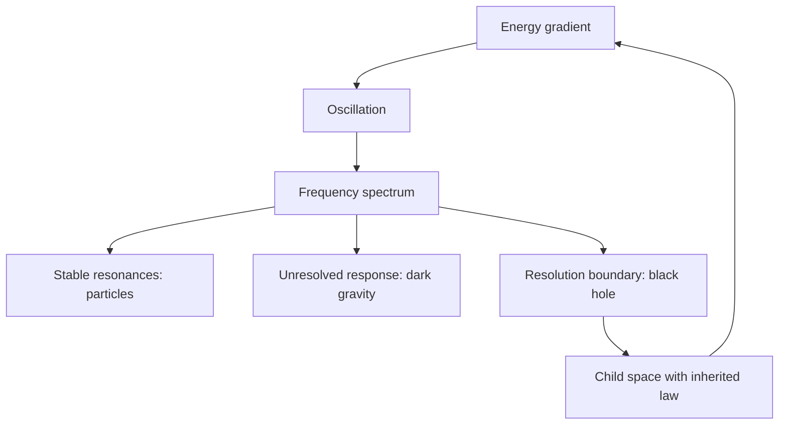

# Nested-Space Cosmology

**New focused mathematical result:** [Nested Qualities and Local Responses](paper/local-incoming-gate-draft.pdf)
gives an explicit finite-window construction, a proof of inherited scale relations,
ordered regional reduction and distinct regional states under the same law.
[Proof and scope](docs/nsc-nested-qualities.md). The separate gravitational
incoming gate remains OPEN and its campaign is paused. Its historical
checkpoint is retained in an appendix and is not a prerequisite for this
finite result. The [43-page foundation](paper/nested-space-cosmology.pdf)
remains unchanged.

**Starting checkpoint `9a9090a`.** The programme is finite nested
regeneration under familiar local laws. The executed calculation is the
spherical Galerkin loop: each Runge–Kutta stage calls
`compose_fine_hamiltonian`, which recomputes the source and the rates
and feeds $F_Q$ into $\dot p_Q$; $Q$, $r$, $\chi$ and the momenta
evolve; $L$ and $\beta$ stay gauge controls; the initial radius uses the
source. That module is the code owner. The v5 replay
remains the self-contained $T=0.005$ seed: full Hamilton about
$9.98\times 10^{-6}$, momentum about $1.38\times 10^{-6}$, maximum
absolute proper radial velocity about $0.0079505$. Signed motion is not
inferred from that maximum.
The saved $T=0.05$ measurement is
`lab/scripts/derive_nsc_spherical_feedback_episode.py`. Four runs reach
the requested time. Proper radial velocity on the fine primary run ends
near $[-0.061956, 0.088159]$, $Q$ stays near $0.2195$ at its minimum, and
$\chi$ reaches about $11.148$. Field and gravitational energy exchange
about $0.4123$. All 62 physical refinement rows meet one percent, worst
relative movement about $5.55\times 10^{-4}$. The fine full Hamilton
residual ends near $2.83\times 10^{-5}$ and the fine momentum residual
near $4.30\times 10^{-6}$; the coarse residual is higher. A
constraint-consistent continuum solution and renewal are not validated.
The historical tolerance $10^{-8}$ is not an automatic veto.
Saved consumers of that episode are recorded and do not close renewal.
The [controls](lab/docs/nsc-regeneration-controls.md) continue the saved
state to $T=0.10$: the leader's shell content rises by about $0.117$,
packet and reservoir fluxes end opposite near $5.534$, and the field
and gravitational energies exchange about $0.396$. On all eleven stored
frames the [conditional local response](lab/docs/nsc-coupled-local-response.md)
moves the fixed region-0 occupation by about $0.33059$. The
[spherical null expansion](lab/docs/nsc-spherical-null-expansion.md)
records a local change in trapping character on the saved chart. The
[controls successor](lab/results/development/nsc-regeneration-controls-v2.json)
reads that stored endpoint. The
[local-boundary review](lab/results/development/nsc-local-boundary-review-v1.json)
checks the saved payloads, the projected endpoint, and a small causal ODE.
The [initial geometry-graded window](lab/docs/nsc-geometry-graded-window.md)
is a completed measurement: leakage about $0.966$ leaves the six columns
outside a closed dynamics.
[Present loop](docs/current-result.md#present-spherical-loop).

A six-mode inherited finite example remains a fixed-geometry witness, with
nonzero channel currents and a derived local filtered response.
[Finite turnover](lab/docs/nsc-finite-turnover.md). On that same frozen
window, an incoherent regional imbalance has a Cesaro mean that still
carries inflow into the region-0 plus mode from the region-1 plus mode.
[Imbalance mean circulation](lab/docs/nsc-imbalance-turnover.md).
The geometry of that witness stays an input. The incoming gate remains
OPEN and its campaign remains paused. It is not a prerequisite.

## One research programme, two complementary papers

The original manuscript remains the foundation of this project. The focused
article is the finite nested-qualities result named above. It does not replace
the broader manuscript, and it does not claim that the cosmology has been proved.
The source-fixed incoming gate is an OPEN appendix of that companion.

| Read | Purpose | Status |
|---|---|---|
| [Foundational manuscript: PDF](paper/nested-space-cosmology.pdf) · [Markdown](paper/nested-space-cosmology.md) | The broad NSC idea, inheritance relation, existing operator calculations, source history and references | Frozen v0.26.0, 15 September 2026, 43 pages |
| [Focused companion: PDF](paper/local-incoming-gate-draft.pdf) · [LaTeX](paper/local-gate-draft/main.tex) | Finite-window nested qualities: inherited scale relations, ordered regional reduction, and distinct regional states under the same law. The incoming gate is an OPEN appendix | Finite construction recorded; gate appendix OPEN and paused. Frozen foundation remains v0.26.0 |

[How the papers fit together](docs/papers.md) ·
[Current scientific status](docs/current-result.md) ·
[Verification and reproducibility](docs/reproducing.md)

This repository now contains the publication and active laboratory together.
The papers stay in `paper/`; current scientific code and evidence are in `lab/`.
Start with [AGENTS.md](AGENTS.md) and [instructions](docs/instructions.md).
The latest user instruction controls. An older conversation plan does not
override it, and old repository plans do not select the task. Work on `codex/work-branch`, integrate verified
changes into `main`, and push both to this GitHub repository.
[Consolidation and historical data](docs/repository-consolidation.md) explains
what was retained and why old search arrays are excluded. Published scientific
claims remain tied to their specific evidence, not merely to GitHub availability.

## Local physics within a larger nested description

The question is the nested mechanism. Structure that a region does not
resolve can still change the local response, and the same relations can
appear across regional gradients. Familiar local laws are the equations a
local observer already uses.

The inherited-law relation is reused inside its stated domain. Time,
antimatter, dark-sector, and continuing-gradient readings stay open
research. A finite candidate can be chosen creatively. Its computation and
its error statement stay checkable. The current finite realization is the
spherical Galerkin loop, because its geometry and state forces already come
from the same action.
[Present loop](docs/current-result.md#present-spherical-loop).
The local incoming gate remains a separate OPEN application, campaign paused.

Pictures of an interior and its surroundings, a room, or two sides of a coin
organize that question. They are motivation. Spherical symmetry is the first
controlled class. Charge conjugation remains the standard map between
particle and antiparticle sectors. A geometric reading of antimatter, and a
dark-sector reading, stay open beside that map.

## What if reality is one inherited spectrum?

A musical note is not a thing separate from its wave. It is a stable pattern
inside an oscillation. Change the frequency and the same underlying motion
appears as a different note.

Nested-Space Cosmology asks whether nature works the same way at every scale:

> **One field. One spectrum. Different stable patterns that we call particles,
> forces, matter, antimatter, dark gravity, black holes, and expanding space.**

The picture is the proposal. Time, antimatter, and further gradients stay
open research beside it.


```mermaid
flowchart TD
  A[Energy gradient] --> B[Oscillation]
  B --> C[Frequency spectrum]
  C --> D[Stable resonances: particles]
  C --> E[Unresolved response: dark gravity]
  C --> F[Resolution boundary: black hole]
  F --> G[Child space with inherited law]
  G --> A
```

A local universe is a **room** with its own clocks, rulers, frequencies, and
resolution. A black hole is the boundary where the parent room can no longer
represent a compressed gradient as an ordinary local object. The proposal is
that the process continues as a child room. The child inherits the same
dimensionless relationships while expressing a wider range of structure.

[Read the idea in plain language](THEORY.md) ·
[Follow the equations and evidence](docs/current-result.md) ·
[Read the foundational manuscript](paper/nested-space-cosmology.pdf)

## Retained application: local incoming gate (OPEN, campaign paused)

The present evolution is the spherical Galerkin loop linked above. This
gate is a retained OPEN test. Its campaign is paused, and it is not a
prerequisite for the finite companion or for that loop. The question it
poses is whether two incoming gravitational constraints can close on
$I=S(1)+[0.12,0.18]$ when a fixed upstream quantum source is transported
along a changed metric history. That interval, source, and threshold belong
only to this application.

$$
C_\Sigma[g]=U_g C_{\mathrm{up}} U_g^\dagger,
\qquad
\delta r=\chi(s)\left[s\,w(z)+\frac{s^3}{6}U(z)\right].
$$

The source stays fixed; its state on the incoming surface responds to the
history. The two unknown functions are $w(z)$ and $U(z)$. For this
application, a successful local existence test needs **both** residuals,
including every error term, below $3\times10^{-11}$ throughout the interval.
The current candidate is a solver seed: its sampled maxima are about
$9.64\times10^{-4}$ and $3.81\times10^{-4}$, well above that target. No
closed local result or arXiv submission is claimed. Pausing does not loosen
this error target and does not impose it on other claims.

- [Focused research draft (PDF)](paper/local-incoming-gate-draft.pdf): English explanations, equations, notation, evidence, and original-source attribution.
- [Current result and exact remaining gaps](docs/current-result.md).
- [Draft source and verification guide](docs/local-gate-draft.md), including hashes and the laboratory commit.
- [Foundational manuscript v0.26.0](paper/nested-space-cosmology.pdf): the preserved broader exposition and existing calculations.

The draft includes a **selected evidence snapshot**, not the full dependency
closure required for a final certificate of that application. The next
release version follows a demonstrated result. This page does not assign
it, and the OPEN gate is not a publication prerequisite. Global matching
and observational fitting are later research. The conceptual picture below
describes the proposal; the linked records distinguish identities,
numerical diagnostics, and open claims.

## From a note to a universe

Every room has a Dirac operator. Its eigenvectors are possible patterns and
its eigenvalues are their natural frequencies:

$$
\boxed{
\mathbb D_n u_{n,k}=\omega_{n,k}u_{n,k},
\qquad
\omega_{n,k}=\Lambda_n\widehat\omega_k(\Theta).
}
$$

- $\Lambda_n$ is the room's frequency and resolution scale.
- $\widehat\omega_k$ is a dimensionless note in the inherited spectrum.
- $\Theta$ is the law shared by parent and child.

If a child has scale ratio $\Omega$, then

$$
\Lambda_{n+1}=\Omega\Lambda_n,
\qquad
\frac{\omega_{n+1,k}}{\Lambda_{n+1}}
=\frac{\omega_{n,k}}{\Lambda_n}.
$$

The absolute range changes. The relationships—the musical intervals of the
law—remain the same.

## One spectrum, many familiar names

| What we observe | Field description or proposed NSC identification |
|---|---|
| **Wave** | The extended amplitude and phase of a field pattern |
| **Particle** | A stable pole or localized resonance of that same field |
| **Matter and antimatter** | Proposed reading of the positive- and negative-frequency Dirac sectors, usually related by charge conjugation; not a derived geometric origin |
| **Mass** | The rest-frequency gap of a physical pole |
| **Dark energy** | Proposed identification with the smooth outside response; cosmological matching remains open |
| **Dark matter** | Proposed identification with finite-wavelength outside response; clustering and lensing matching remain open |
| **Black hole** | A causal and resolution boundary reached by a sufficiently compressed gradient |
| **Child universe** | The continuation of that gradient in a new room with inherited spectral law |
| **Complexity** | More distinguishable modes and stable combinations within a wider resolved spectrum |

The matter–antimatter correspondence is a frequency orientation, not merely
the drawn height of a sine wave:

$$
\Psi(x)=\sum_s\int d^3p\,
\left[
a_s(\mathbf p)u_s(\mathbf p)e^{-ip\cdot x}
+b_s^\dagger(\mathbf p)v_s(\mathbf p)e^{+ip\cdot x}
\right].
$$

The two phases $e^{-i\omega t}$ and $e^{+i\omega t}$ become particle and
antiparticle sectors after quantization. Charge conjugation reverses the gauge
representation. A real sine wave displays both orientations:

$$
\sin(\omega t)=\frac{e^{i\omega t}-e^{-i\omega t}}{2i}.
$$

Charge conjugation here means that standard map. It does not derive antimatter
from nested geometry, and it does not forbid asking whether a geometric origin
exists. The sine-wave picture is an illustration, not a literal identity.

## A black hole already plays a cosmic bass note

The Perseus galaxy cluster contains literal pressure waves driven by repeated
outbursts from its central supermassive black hole. Their period is just under
ten million years:

$$
\nu_{\rm Perseus}\simeq3.3\times10^{-15}\ \mathrm{Hz},
$$

about 57 octaves below the B-flat above middle C. The waves carry energy into
the surrounding gas and help prevent it from cooling. This is measured
black-hole feedback expressed as frequency, scale, and energy transfer—not
just a sonification metaphor. [Chandra explains the pressure waves and octave
calculation](https://chandra.harvard.edu/chronicle/0303/perseus/index.html).

NSC applies the same spectral language across a much larger range. Since

$$
E=\hbar\omega,
\qquad
\lambda=\frac{2\pi c}{\omega},
$$

higher frequencies resolve shorter lengths. Concentrating enough energy to
reach the local resolution wall changes the geometry. The black-hole boundary
then becomes the handoff between the parent spectrum and its child.

At that boundary, reflection and transmission are two parts of one scattering
response:

$$
|R(\omega)|^2+|T(\omega)|^2=1.
$$

The parent observes what returns through $R$. The part carried through $T$
continues beyond its locally accessible chart. A black shadow, a throat, and
an expanding interior are therefore three observer-dependent views of the
same boundary problem. The repository computes the complex Dirac reflection,
transmission, and the inherited child stress for its smooth benchmark.

## How another room acts without being locally visible

Put a parent and child in one block operator:

$$
H=
\begin{pmatrix}
H_p&B\\
B^\dagger&H_c
\end{pmatrix}.
$$

Eliminating the child does not erase it. It leaves a visible self-energy:

$$
\boxed{
G_{pp}(E)^{-1}
=E-H_p-B(E-H_c)^{-1}B^\dagger.
}
$$

This one formula explains how something outside local resolution can still
change local response, wherever the displayed inverses exist. The proposed
cosmological identification of its momentum limits is:

$$
\Pi_{\rm outside}(k\rightarrow0)
\longrightarrow\text{smooth background expansion},
$$

$$
\Pi_{\rm outside}(k>0)
\longrightarrow\text{clustering and lensing response}.
$$

That is the proposed common origin of dark energy and dark matter: two ranges
of one regional response. Deriving the required stress and perturbation laws
would establish that identification; it is not supplied by the block identity alone.

The familiar rounded $5\%/25\%/70\%$ split is an observational dictionary
for a later hierarchy:

| Observation | NSC interpretation to test | What would have to be calculated |
|---|---|---|
| $\sim5\%$ baryons | Locally resolved spectrum | Physical poles, residues, charges, and sector assignments |
| $\sim25\%$ dark matter | Nearest unresolved room response and finite-$k$ Schur projection | Pressure perturbations, anisotropic stress, clustering, and growth |
| $\sim70\%$ dark energy | More distant recursive tail and zero-momentum projection | Background density and pressure, conservation, and $H(z)$ |

This ordering is a measurable hypothesis. It is separate from the paused
incoming-gate application. The fractions do not prove it, and
the fixed-$q$ scale candidate does not determine these cosmological weights.

## The law that every room inherits

The complete proposal is compressed into

$$
\boxed{
\mathcal T_\Theta^*\mathbb D_\Theta=\mathbb D_\Theta.
}
$$

The configuration changes from parent to child. The dimensionless law does
not. The child's own descendants are already contained in its response:

$$
\boxed{
\Gamma_p(x)
=K_p(x)-\frac1\Omega
b\,\Gamma_c(x/\Omega)^{-1}b^\dagger.
}
$$

The zero of gravitational energy is also relational. The recursive
zero-tadpole law removes only the homogeneous unlinked vacuum term:

$$
\boxed{
\Gamma_{\rm rel}=(1-\mathcal P_0)\Gamma_{\rm one},
\qquad
(V,A,C)\mapsto(0,A,C).
}
$$

Curvature, gauge response, Casimir energy, links, and finite boundary effects
remain. In the charged-throat map this gives $V_{\rm full}=\lambda_4=\Xi=0$
without changing $G_N$, the gauge coefficient, charge radius, or throat length.

## What the calculations already connect

| Connection | Result | Reproducible evidence |
|---|---|---|
| One link controls mass and visible response | $E^2=\lvert\mathbf p\rvert^2+\Phi^2$ and $\Sigma_p(E)=\Phi^2(E+\boldsymbol\alpha\cdot\mathbf p)^{-1}$ | [Dirac reduction](docs/nsc-observable-bridge.md) |
| Geometry determines transmission | Direct propagation, transfer matrices, and boundary elimination agree below $2.3\times10^{-15}$ in the recorded full-spinor system | [Boundary calculation](docs/nsc-chiral-boundary.md) |
| One coherence stores energy and transfers occupation | $E_{\rm link}=2\Re\mathrm{Tr}(BC_{cp})$ and $\dot N_p=2\Im\mathrm{Tr}(BC_{cp})$ | [Common-source derivation](docs/nsc-common-source-derivation.md) |
| Geometry can become particles | A smooth radius pulse creates Dirac pairs and its work equals their energy | [Vacuum-work experiment](docs/nsc-vacuum-work.md) |
| Parent data determine child stress | Both recorded radial null contractions are about $-0.05280$ and the parent power is $1.4222\times10^{-4}$ | [Parent-matched source](docs/nsc-unruh-state.md) |
| Causal response and geometric source share one state | Canonical CTP returns metric forces, retarded response, noise, and energy balance from one covariance | [Causal common functional](docs/nsc-causal-common-functional.md) |
| The recorded model chooses a homogeneous-vacuum normalization | The idempotent $a_0$ projector sets $V_{\rm full}=0$ while preserving gradient response | [Relational vacuum law](docs/nsc-relational-vacuum-normalization.md) |
| The charged radius fixes a candidate inherited scale | The first cutoff-resolved branch among the checked $q=2,3,4$ sectors gives $\Omega=3.9730743688$ and $\zeta=15.7853199397$ | [Scale binding](docs/nsc-scale-binding.md) |
| The simplest recursive LLL source is decisively testable | Its inherited power closes exactly, but its two null signs do not source the black-universe neck | [Source binding](docs/nsc-recursive-source-binding.md) |
| Positive compact modes complete the free CTP neck source | The completed tensor has $T_{++}=-0.246592$ and $T_{--}=-0.251487$ at the locked scale | [Compact CTP completion](docs/nsc-compact-ctp-completion.md) |
| The completed source enters the child energy ledger | Proper volume and child time give $\dot\rho_0=0.3877601353$ with total regular bulk $Q=0$ | [Background projection](docs/nsc-background-projection.md) |
| Backreaction has an exact initial gate | The locked source misses the Hamiltonian and momentum constraints already at $T=0$ | [Backreaction gate](docs/nsc-child-metric-backreaction.md) |
| The same source selects constraint-complete geometry | Its Landau normal and $r_\star=0.9453283944$ close both initial constraints | [Constraint-complete neck](docs/nsc-constraint-complete-neck.md) |
| Coupled evolution has an exact state-data gate | The radius vertex is nonzero, so later pressure requires the actual mode covariance | [Coupled evolution gate](docs/nsc-coupled-ctp-metric-evolution.md) |
| The retained Gaussian state is now explicit | A deterministic payload stores all 1,904 physical covariance blocks and reconstructs the old tensor | [Mode-resolved state](docs/nsc-mode-resolved-cauchy-state.md) |
| A declared history gives a unitary Cauchy map | Two endpoint-identical histories preserve CAR but produce different $U$, so the physical history remains the selector | [Landau Cauchy gate](docs/nsc-landau-cauchy-isometry.md) |
| The joint BVP has a measured uniqueness obstruction | Route A fails its seed constraints and route B gives distinct state histories at the same endpoints | [Joint BVP gate](docs/nsc-joint-history-state-bvp.md) |
| The homogeneous history variation is now executable | Its shift equation proves no stationary frequency-diagonal KS history exists from the locked seed | [General-KS history gate](docs/nsc-general-ks-same-action-history.md) |
| The tilted/frequency-mixing components are executable | Reference and bulk/interface algebra pass; physical kernel selection and Weyl endpoint completion remain open | [Extended tilted gate](docs/nsc-extended-tilted-history-gate.md) |

The background projection uses the exact completed tensor on the stored
Bronnikov child geometry. Volume dilution contributes `-0.1568673338` and
directional pressure work contributes `+0.5446274691`; the conservation and
parent-power map close below `4.4e-16`. The parent Killing power becomes the
opposite of a conserved child spatial-momentum charge, so it is not counted
again as a continuing child energy source.

These are recorded foundations within their stated classes. The full
chronological discussion remains in [earlier public checkpoints](docs/current-result.md#earlier-public-checkpoints)
and the original manuscript. The source-fixed incoming gate above is one
chosen application: OPEN, with its campaign paused. Those older checkpoints
are not a queue of derivations to restart, and that gate is not a prerequisite
for the records above.

## Explore at your own depth

1. [The theory in one continuous story](THEORY.md)
2. [The calculated equations and numbers](docs/current-result.md)
3. [The 46-record development update](docs/development-update-2026-09-10.md)
4. [The 100-record preprint manifest](results/manifest.json)
5. [How to inspect and reproduce results](docs/reproducing.md)
6. [The working paper](paper/nested-space-cosmology.pdf)

```sh
python3 -m pip install -e '.[paper]'
make demonstrate
```

The default demonstration reads authenticated stored results without launching
the expensive scientific generators.

## Research status

NSC is an active theoretical programme and working preprint. Its exact
identities and numerical results apply to the operators, states, domains, and
approximations named in their records. The present numerical records are the
spherical Galerkin loop, the $T=0.10$ controls, the stored-frame local
response, and the sampled null expansion in
[the current result](docs/current-result.md#present-spherical-loop).
Renewal is not closed. Reusable identities, proposed interpretations, and the
paused incoming-gate application remain separate. Time, antimatter,
dark-sector, and continuing-gradient readings remain open research. A complete
self-sourced parent-to-child solution, an identified particle spectrum, and an
independent cosmological prediction are not yet recorded.

## Authorship

**Douglas Ek** provides the conceptual synthesis, research direction, and
scientific responsibility. ChatGPT/OpenAI Codex assisted with formulation,
derivations, software, computation, and writing; Grok supplied bounded
investigations. The principal collaborating sessions are identified as
GPT-5.6 Sol and GPT-6 Astra.

Code: MIT. Original prose and figures: CC BY 4.0.
[Citation](CITATION.cff) · [Contributing](CONTRIBUTING.md) · [Licence](LICENSE)
