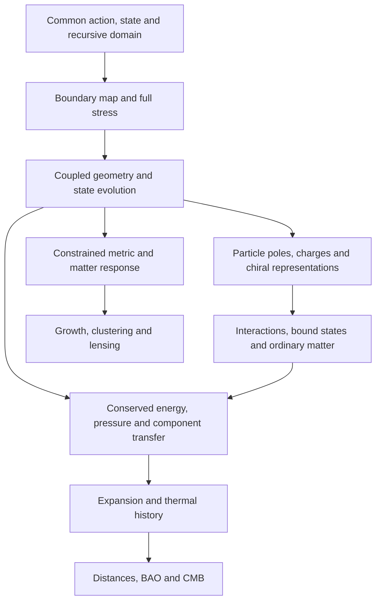

# From sheet geometry to particle and cosmological observables

The sheet/handedness proposal now has a precise constructive realization:
a local scalar sheet coupling admits an invariant four-component sector
whose dynamics are exactly the massive Dirac equation. The actual throat
has not yet selected that sector or supplied the required coupling.

The [new record](../results/nsc-7-observable-bridge.json) checks the Clifford,
chirality, charge, reflection and source identities exactly, with independent
time-evolution and conservation controls. Its code owner is
`src/recursive_horizons/nsc_spinor_bridge.py`; reproduce with
`python3 -B scripts/check_nsc_observable_bridge.py --check`.

## A constructive sheet/chirality sector

Use signature +--- and Weyl spinor order (left,right). Physical chirality
is gamma5=diag(-I2,I2). Geometric sheet matrices tau_i act on a separate
factor. Start with the candidate local Lorentz-scalar bilinear

\[
\mathcal L=\bar\Psi(i\slashed\partial-M)\Psi,
\qquad M=\Phi\tau_1\otimes I_4,
\]

whose Hamiltonian is

\[
H_8=I_2\otimes\boldsymbol\alpha\cdot\mathbf p+
       \Phi\tau_1\otimes\beta.
\]

This is a benchmark for an effective boundary interaction. It does not
replace the protected project's Euclidean gamma5-Phi proposal, determine
its continuation, or assert that its evaluated energy-dependent boundary
map is already a scalar mass. No new dynamical scalar field is inserted.

Let

\[
\Pi_- =\frac{I_8-\tau_3\otimes\gamma^5}{2},
\qquad W=(e_0,e_1,e_6,e_7).
\]

W selects parent-left and child-right in sheet-first Weyl ordering. Exact
matrix identities establish

\[
\boxed{\Pi_-^2=\Pi_-,\quad [H_8,\Pi_-]=0,\quad
WW^\dagger=\Pi_-,\quad
W^\dagger H_8W=\boldsymbol\alpha\cdot\mathbf p+\Phi\beta.}
\]

Thus the two sheet labels can encode the two chiral components in this
restricted sector. This is an actual invariant embedding, stronger than
recognizing similar 2-by-2 matrix shapes.

However, Pi_+=(I8+tau3 tensor gamma5)/2 is an equally invariant rank-four
sector, related by sheet exchange. The unrestricted model contains two
equivalent Dirac sectors. Its spectrum does not select one assignment.
In the unrestricted space, every sheet/chirality joint projector has rank
two. A physical reduction needs an action/domain/constraint reason to select
the desired sector, and must preserve that selection under interactions.

For a general geometric block H with diagonal Hp,Hc and off-diagonal B,
the candidate restriction requires compatible domains and

\[
[H_p,\gamma^5]=[H_c,\gamma^5]=0,
\qquad \{B,\gamma^5\}=0.
\]

Recovering the displayed local Dirac equation further requires compatible
kinetic geometry and an appropriate local limit of B. Different sheet
scales, lapse/shift, energy dependence and compact-mode mixing must be
handled by the existing normalized boundary calculation.

## The shared gap and self-energy survive with the right spinor structure

The scalar Hamiltonian link is B=Phi beta, and therefore

\[
H_8^2=(|\mathbf p|^2+\Phi^2)I_8,
\qquad
\Sigma_p(z)=\Phi^2(z+\boldsymbol\alpha\cdot\mathbf p)^{-1}.
\]

This is the precise Lorentzian version of the shared gap/visible-response
relation for this candidate. The factor beta matters. A spinor-identity link
B=Phi I4 instead gives energies ±|p|±Phi and becomes gapless at |p|=|Phi|.
The record checks both spectra directly at |p|=Phi=1.

A Hermitian pseudoscalar Hamiltonian link B=i Phi beta gamma5 has the same
free gap and this same self-energy. Consequently, even these two successful
spectral identities do not select the interaction's complete Clifford or
parity structure. A Euclidean gamma5 link needs its own consistent
Lorentzian continuation; gamma5, beta gamma5 and i beta gamma5 cannot be
interchanged without checking the action and adjoint conventions.

The next field-identification calculation is therefore to derive the
Clifford structure, locality and symmetry action of the actual throat map.
The new scalar example supplies a target and exact controls, not that derivation.

## Chirality, radial components and mass are different labels

For a four-dimensional Dirac particle,

\[
H=\begin{pmatrix}-\boldsymbol\sigma\cdot\mathbf p&mI\\
mI&\boldsymbol\sigma\cdot\mathbf p\end{pmatrix},\qquad
[H,\gamma^5]=2m\beta\gamma^5.
\]

The mass couples the chiral fields. A fixed-helicity positive-energy eigenstate has
constant chirality expectation lambda |p|/E. An initially pure left-chiral
vector instead gives

\[
P_{L\to R}(t)=\frac{m^2}{E^2}\sin^2(Et),\qquad E^2=p^2+m^2.
\]

For m>0 that initial vector contains both positive- and negative-frequency
components. Its oscillation is a specified-state result, not universal
physical bouncing of every massive energy eigenstate. The record verifies
both behaviors with matrix exponentials. These Dirac transformation laws
are standard; see [Tong's Dirac-field treatment](https://www.damtp.cam.ac.uk/user/tong/qft/qfthtml/S4.html).

The existing radial term kappa/r deserves a separate test. Write eta for
the paired (+kappa,-kappa) angular labels and rho for radial (F,G). In the
standard spherical convention

\[
\psi_\kappa=r^{-1}(F\Omega_\kappa,iG\Omega_{-\kappa})^T,
\quad \boldsymbol\sigma\cdot\hat r\,\Omega_\kappa=-\Omega_{-\kappa},
\]

physical gamma5 maps (F,G,kappa) to (iG,-iF,-kappa). Hence

\[
\Gamma_5=-\eta_1\otimes\rho_2,\qquad
H_0=I\otimes(-i\rho_2\partial_x)+
       \eta_3\otimes\frac{\kappa}{r}\rho_1,
\qquad [H_0,\Gamma_5]=0.
\]

The geometry-pulse vertex also commutes with Gamma5. The previously computed
vacuum pair production can therefore occur while preserving massless
physical chirality in the continuum paired angular problem. A geometric
radial or band gap is not by itself a four-dimensional chirality-breaking
Dirac mass. Single-channel rho3 anticommutes with H_kappa and pairs E with
-E; that spectral grading is not physical gamma5.

These are continuum operator/domain identities. We have not established a
naive exact gamma5 map on the staggered node/edge finite regulator by writing
the same matrix on both grids. The angular and domain map must survive the
continuum or an explicitly compatible regularization before physical claims.

## Parity and antiparticles

On an even throat, with a compatible paired angular domain, the spinor lift
of normal reflection is S_perp=eta1 tensor rho3. Combining it with x→-x gives

\[
\mathsf P_{\rm throat}H\mathsf P_{\rm throat}^{-1}=H,
\qquad
\mathsf P_{\rm throat}\Gamma_5\mathsf P_{\rm throat}^{-1}=-\Gamma_5.
\]

This is a concrete reflection/chirality relation. Boundary conditions and
spin structure must respect it; a prepared state or asymmetric radius pulse
need not. Reflection through the throat and ordinary spatial parity should
not be conflated without this geometric/spinor map.

Ordinary parity is psi(t,x)→beta psi(t,-x). Charge conjugation on c-number
Dirac spinors is psi^c=i gamma2 psi*, together with the conjugate gauge
representation. In the restricted sheet sector, the combined operators
tau1 tensor beta and (tau1 tensor i gamma2)K restrict to ordinary parity and
charge conjugation respectively. This demonstrates a possible combined
representation; sheet exchange alone performs neither full operation.

Both chiral components of a charged Dirac field carry the same charge.
For the candidate scalar bridge,

\[
[qI_8,H_8]=0,
\qquad
[q\tau_3\otimes I_4,H_8]
=2iq\Phi\tau_2\otimes\beta\ne0.
\]

Thus assigning opposite charges to the two sheets is incompatible with a
fixed neutral scalar bridge. A charge-carrying link would need its own
derived transformation and dynamics. A local orientation gradient alone
does not produce the conjugate representation or a matter–antimatter
asymmetry. The geometry-pulse calculation creates equal particles and holes.

CPT of the full recursive field theory has not been proved from
self-adjointness. It requires the relevant field-theory assumptions,
background/orientation map and domains; an arbitrary state need not be
invariant. [Hollands' curved-spacetime PCT theorem](https://arxiv.org/abs/gr-qc/0212028)
illustrates these qualifications. Photons likewise need a spin-one gauge
sector: massless Dirac/Weyl spinors and photons are not the same representation.

## The complete equation-to-observation route

The [observational targets](nsc-observational-targets.md) spell out the
background and perturbation requirements. Internal Q_b cancels from total
continuity; external room supply J is a different quantity and requires
complete gravitational accounting. A throat area integral yields power,
and a worldtube integral yields energy. A cosmological Q additionally needs
proper-time, proper-volume and deposition/conversion factors.

Q_b=0 does not itself force q_dec→1/2: dust plus positive Lambda is an exact
counterexample. The finite-plateau hypothesis is necessary for the earlier
dust-like conclusion. A known Q_b also leaves pressure and the perturbation
response undetermined. Scalar Q alone cannot predict H(z), S8, or lensing.

## Concrete next work

1. Restore the full spinor and angular boundary data and compute the actual
   map's Clifford components and symmetry/domain transformations. Test
   whether a controlled local scalar or pseudoscalar limit exists.
2. Test the invariant-sector conditions on that map and derive any physical
   sector selection from the common action; a convenient projection is
   insufficient. Preserve the independent scale and normalization equations.
3. Solve absolute stress, geometry and quantum state together, including
   geometric work and any physical room supply. The prescribed pulse remains
   a development control.
4. Derive charge/gauge representations, mass poles, interactions and bound
   states before assigning electron/proton/neutron or dust identities.
5. Derive background and constrained perturbation response, then freeze
   predictions and compare jointly with observation. Inspected data remain
   development evidence.

Likely obstacles are an energy-dependent/nonlocal map with no scalar mass
limit; an unselected or noninvariant chiral sector; and an undetermined
absolute stress, state or metric response. Each points to a specific next
derivation rather than an invented observational prediction. The embedding
and symmetry checks are new within this project; no new-to-world particle
mechanism or complete account of observations is claimed.

## Verification

The integrated laboratory gate passes 139 tests and reproduces all 17 active
records. This result contains 53 exact spinor/sector identities and four exact
source-accounting identities, with numerical evolution and counterexamples.
All scientific fields and provenance hashes are checked on reproduction.
Independent Codex derivations checked the physical angular expansion,
restriction, charge conjugation and cosmological source formulas. A completed
read-only Grok review independently checked the vector/axial Ward and
same-charge/opposite-charge sheet algebra. Review findings were integrated;
no worker assertion substitutes for the executable identities.
